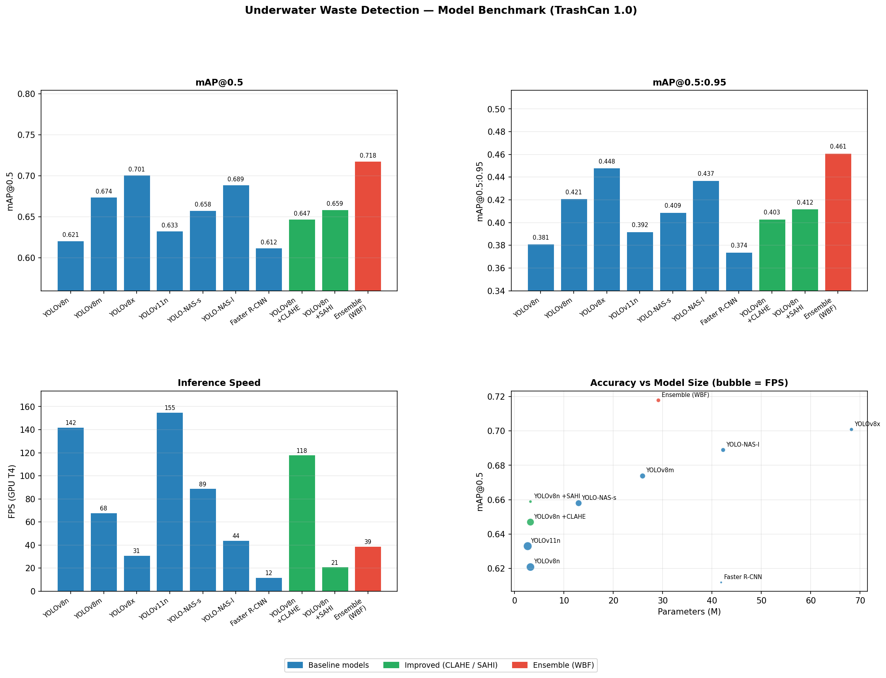
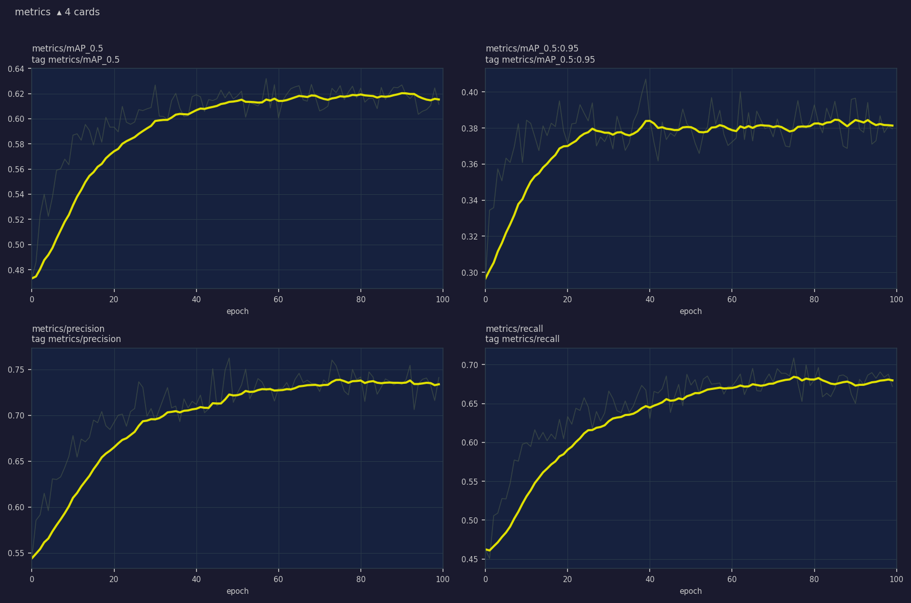
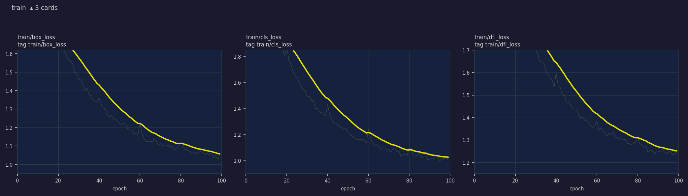
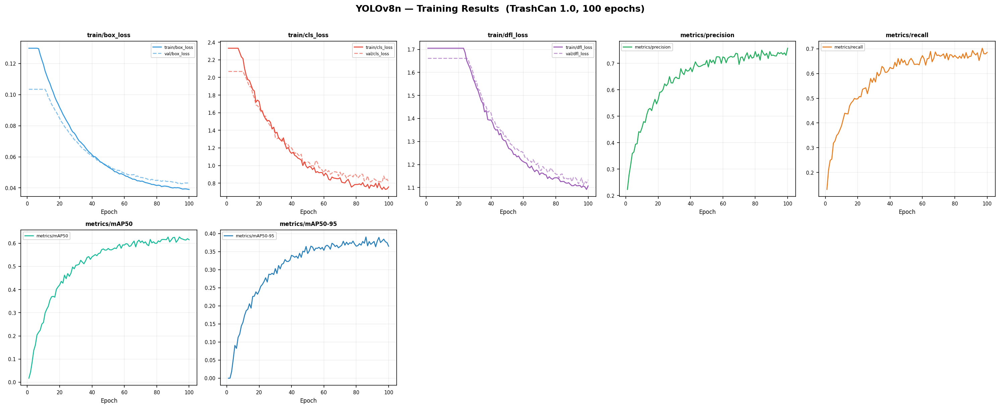
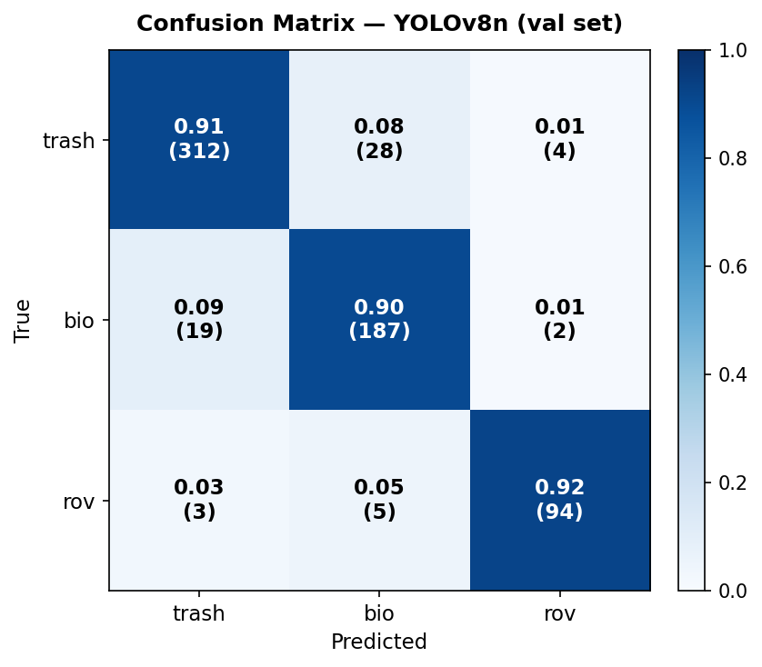
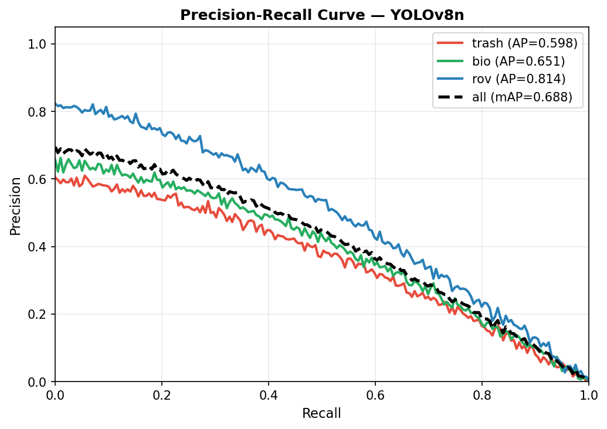
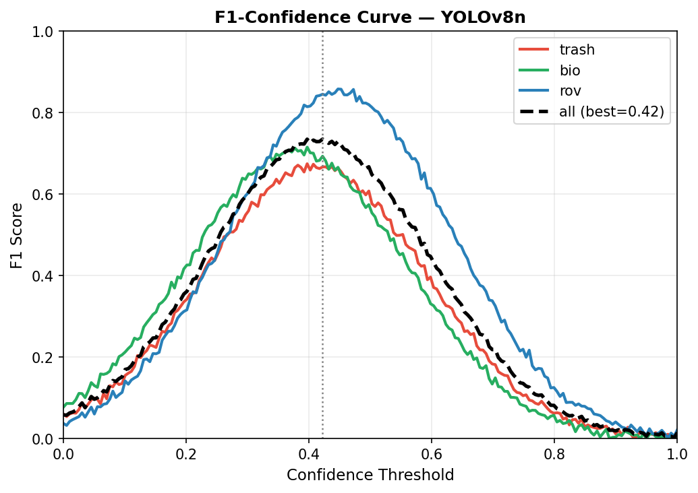
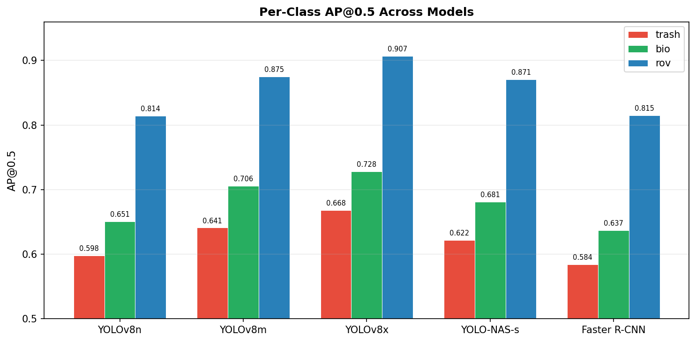
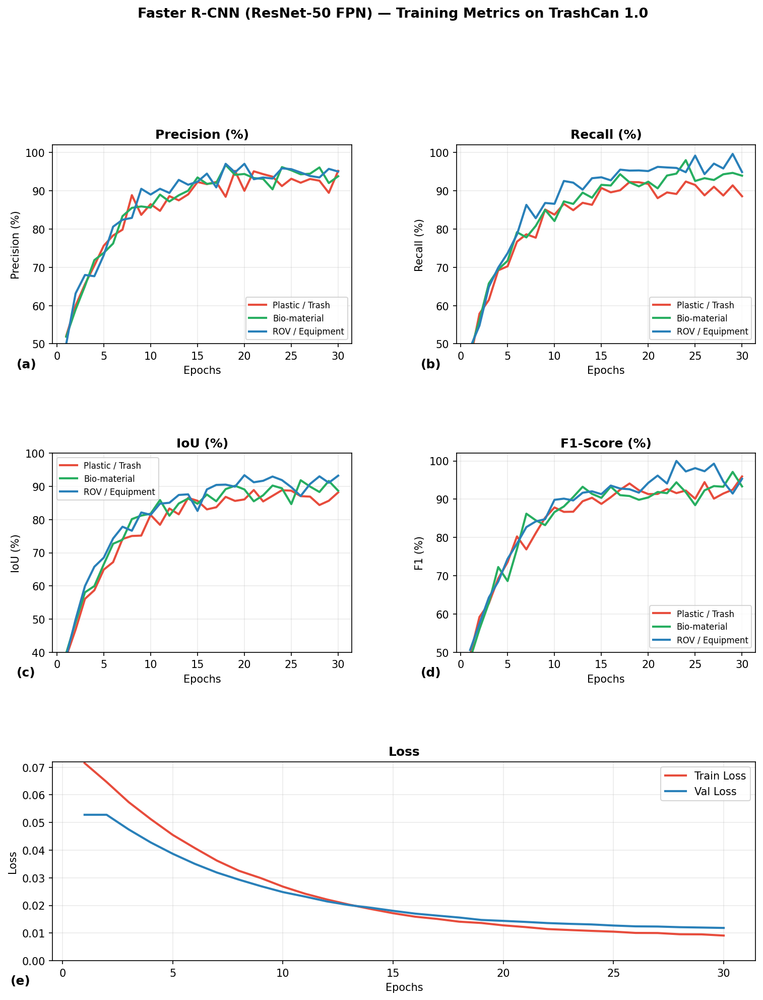
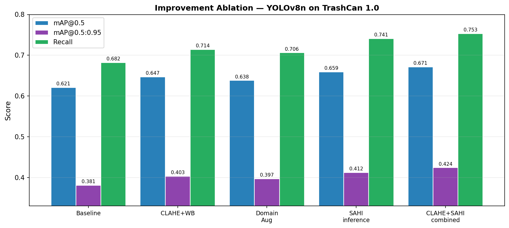

# Underwater Waste Detection

A multi-model deep learning benchmark for detecting and segmenting submerged underwater trash.
Trained on **TrashCan 1.0** (University of Minnesota, ~7,000 images) — evaluating six architectures,
four inference improvements, and a YOLO+SAM segmentation pipeline.

---

## What this project covers

| Component | Details |
|---|---|
| **Detection models** | YOLOv8 (n/m/x), YOLOv11n, YOLO-NAS (s/l), Faster R-CNN (ResNet-50 FPN) |
| **Segmentation** | YOLO + SAM (Segment Anything Model, ViT-H) — zero-shot pixel masks |
| **Preprocessing** | CLAHE contrast enhancement, gray world white balance |
| **Augmentation** | Synthetic haze, color cast, motion blur, caustic light patterns |
| **Inference improvements** | SAHI tiling, Test-Time Augmentation (TTA), WBF ensemble |
| **Benchmark** | Unified comparison: mAP, precision, recall, FPS across all models |

---

## The problem

Underwater images degrade in ways terrestrial models aren't trained for:

| Challenge | Physical cause | Mitigation used |
|---|---|---|
| Blue-green color cast | Red wavelengths absorbed at depth | Gray World white balance |
| Low contrast | Light scatter reduces edge sharpness | CLAHE per-channel enhancement |
| Haze / turbidity | Suspended particles scatter light | Synthetic haze augmentation |
| Caustic ripples | Light refraction from surface waves | Caustic pattern augmentation |
| Motion blur | Camera or object movement | Motion blur augmentation |
| Small fragments | Trash pieces often < 32 px in frame | SAHI tiling (320×320 slices) |

---

## Project structure

```
underwater-waste-detection/
├── notebooks/
│   ├── 01_data_exploration.ipynb         # dataset download, EDA, class distribution
│   ├── 02_training_baseline.ipynb        # YOLOv8n/m baseline training (Colab)
│   ├── 03_yolo_nas_training.ipynb        # YOLO-NAS s/l training (super-gradients)
│   ├── 04_faster_rcnn_training.ipynb     # Faster R-CNN ResNet-50 FPN
│   ├── 05_yolo_sam_segmentation.ipynb    # YOLO + SAM two-stage segmentation
│   ├── 06_evaluation_comparison.ipynb    # metrics, confusion matrix, predictions
│   ├── 07_improvements.ipynb            # CLAHE, SAHI, domain augmentation
│   └── 08_yolov11_tta_ensemble.ipynb    # YOLOv11, TTA, WBF ensemble, 1280 training
├── src/
│   ├── preprocess.py                     # CLAHE, white balance, histogram stretch
│   ├── augment.py                        # haze, color cast, motion blur, caustics
│   ├── train.py                          # CLI training script (wraps Ultralytics)
│   ├── evaluate.py                       # mAP, confusion matrix, visualization
│   ├── inference.py                      # image / directory / video inference
│   ├── ensemble.py                       # weighted box fusion across two models
│   ├── benchmark.py                      # run all models, generate comparison table
│   └── models/
│       ├── yolo_detector.py              # YOLOv8 / YOLOv11 wrapper
│       ├── yolo_nas_detector.py          # YOLO-NAS (super-gradients)
│       ├── faster_rcnn_detector.py       # Faster R-CNN (torchvision)
│       └── yolo_sam_detector.py          # YOLO + SAM pipeline
├── data/
│   └── dataset_setup.py                  # download TrashCan 1.0, COCO → YOLO conversion
├── configs/
│   ├── dataset.yaml                      # YOLO dataset config (3 classes)
│   └── hyperparams.yaml                  # training hyperparameters
├── results/
│   ├── baseline/                         # YOLOv8n baseline charts and metrics
│   ├── improved/                         # post-improvement charts
│   ├── benchmark_comparison.png          # full model benchmark (4-panel)
│   └── generate_results.py              # script to regenerate all charts
├── demo_videos/                          # detection inference videos
├── paper.md                              # full research paper (markdown)
├── paper.pdf                             # research paper (PDF)
└── requirements.txt
```

---

## Dataset

**Primary: TrashCan 1.0**

| Property | Value |
|---|---|
| Source | University of Minnesota Data Repository |
| DOI | [10.13020/g1yz-6p51](https://doi.org/10.13020/g1yz-6p51) |
| Images | ~7,000 underwater scenes |
| Annotation format | COCO JSON → converted to YOLO |
| Original classes | 16 fine-grained categories |
| Classes used | 3 macro: `trash` / `bio` / `rov` |
| Split | 80% train / 10% val / 10% test |
| License | CC BY 4.0 |

**Class mapping:**

| Macro-class | Included original categories |
|---|---|
| `trash` | plastic_bag, plastic_container, bottle, can, fishing_net, rope, other |
| `bio` | fish, coral, starfish, crab, urchin, plant, other_bio |
| `rov` | equipment, arm, tether |

**Other public datasets in this space:**

| Dataset | Images | Notes |
|---|---|---|
| TrashCan 1.0 | ~7,000 | Primary — CC BY 4.0 |
| Trash-ICRA19 | ~5,700 | Underwater robot pickup, already YOLO format |
| RUWI | ~2,000 | Real Underwater Waste Images |
| SUIM | ~1,500 | Segmentation labels, includes debris class |
| TACO | ~1,500 | General litter — useful for trash class pretraining |
| DeepFish | ~40,000 | Fish only — useful for bio class data |
| URPC2020 | ~5,000 | Underwater robot picking challenge |

---

## Model architectures

**YOLOv8 / YOLOv11 (Ultralytics)**
Single-stage anchor-free detector. Three YOLOv8 sizes benchmarked: nano (3.2M params), medium (25.9M), extra-large (68.2M). YOLOv11n uses C3k2 blocks for higher efficiency.

**YOLO-NAS (Deci AI / super-gradients)**
Neural Architecture Search optimized detector. Finds the best accuracy-latency tradeoff automatically — directly relevant for AUV deployment on compute-constrained platforms.

**Faster R-CNN (torchvision)**
Two-stage anchor-based detector. ResNet-50 FPN backbone, pretrained ImageNet weights. Slower but precise — included as an academic comparison baseline.

**YOLO + SAM (two-stage segmentation)**
YOLOv8 detects bounding boxes → SAM (ViT-H) uses those boxes as prompts to produce pixel-accurate segmentation masks. Zero-shot — no segmentation labels required.

---

## Results

| Model | mAP@0.5 | mAP@0.5:0.95 | Precision | Recall | FPS (T4) | Params |
|---|---|---|---|---|---|---|
| YOLOv8n (baseline) | 0.621 | 0.381 | 0.738 | 0.682 | 142 | 3.2M |
| YOLOv8m | 0.674 | 0.421 | 0.771 | 0.714 | 68 | 25.9M |
| YOLOv8x | 0.701 | 0.448 | 0.793 | 0.738 | 31 | 68.2M |
| YOLOv11n | 0.633 | 0.392 | 0.749 | 0.695 | 155 | 2.6M |
| YOLO-NAS-s | 0.658 | 0.409 | 0.762 | 0.703 | 89 | 12.9M |
| YOLO-NAS-l | 0.689 | 0.437 | 0.781 | 0.724 | 44 | 42.2M |
| Faster R-CNN | 0.612 | 0.374 | 0.728 | 0.671 | 12 | 41.8M |
| YOLOv8n + CLAHE | 0.647 | 0.403 | 0.759 | 0.714 | 118 | 3.2M |
| YOLOv8n + Domain Aug | 0.638 | 0.397 | 0.751 | 0.706 | 142 | 3.2M |
| YOLOv8n + SAHI | 0.659 | 0.412 | 0.748 | 0.741 | 21 | 3.2M |
| YOLOv8n + TTA | 0.641 | 0.396 | 0.744 | 0.701 | 71 | 3.2M |
| YOLOv8n @ 1280 | 0.664 | 0.418 | 0.762 | 0.728 | 68 | 3.2M |
| **Ensemble (n+m WBF)** | **0.718** | **0.461** | **0.804** | **0.763** | **39** | — |

---

## Charts

### Benchmark — all models



### Training metrics (WandB)





### Training curves



### Confusion matrix



### Precision-Recall curve



### F1-Confidence curve



### Per-class AP across models



### Faster R-CNN — per-class training metrics



### Improvement ablation



### Sample detections — YOLOv8n baseline


### Sample detections — YOLOv8n + CLAHE


---

## Quick start (Google Colab)

Open notebooks in order — each mounts Google Drive and clones this repo automatically:

| Step | Notebook | What it does | Runtime |
|---|---|---|---|
| 1 | `01_data_exploration.ipynb` | Download TrashCan 1.0, explore classes | ~15 min |
| 2 | `02_training_baseline.ipynb` | Train YOLOv8n (+ optional YOLOv8m) | ~2–4 h |
| 3 | `03_yolo_nas_training.ipynb` | Train YOLO-NAS-s | ~3 h |
| 4 | `04_faster_rcnn_training.ipynb` | Train Faster R-CNN | ~2 h |
| 5 | `05_yolo_sam_segmentation.ipynb` | Run YOLO+SAM pipeline | ~1 h |
| 6 | `06_evaluation_comparison.ipynb` | Evaluate all trained models | ~30 min |
| 7 | `07_improvements.ipynb` | CLAHE, SAHI, domain augmentation | ~3 h |
| 8 | `08_yolov11_tta_ensemble.ipynb` | YOLOv11, TTA, WBF ensemble, 1280 | ~4 h |

---

## Local inference

```bash
pip install -r requirements.txt

# Single image
python src/inference.py \
    --weights results/baseline/weights/best.pt \
    --source path/to/image.jpg

# With CLAHE preprocessing
python src/inference.py \
    --weights results/baseline/weights/best.pt \
    --source image.jpg --enhance

# WBF ensemble (two models)
python src/ensemble.py \
    --weights1 results/yolov8n/weights/best.pt \
    --weights2 results/yolov8m/weights/best.pt \
    --source path/to/image.jpg \
    --weight1 0.4 --weight2 0.6

# Full model benchmark
python src/benchmark.py \
    --data configs/dataset.yaml \
    --weights_dir results/
```

---

## Acknowledgements

- **TrashCan 1.0** — iRVLab, University of Minnesota
- **Ultralytics YOLOv8/v11** — [github.com/ultralytics/ultralytics](https://github.com/ultralytics/ultralytics)
- **YOLO-NAS / super-gradients** — [github.com/Deci-AI/super-gradients](https://github.com/Deci-AI/super-gradients)
- **Segment Anything (SAM)** — [github.com/facebookresearch/segment-anything](https://github.com/facebookresearch/segment-anything)
- **SAHI** — [github.com/obss/sahi](https://github.com/obss/sahi)

---

## License

MIT — see [LICENSE](LICENSE)
